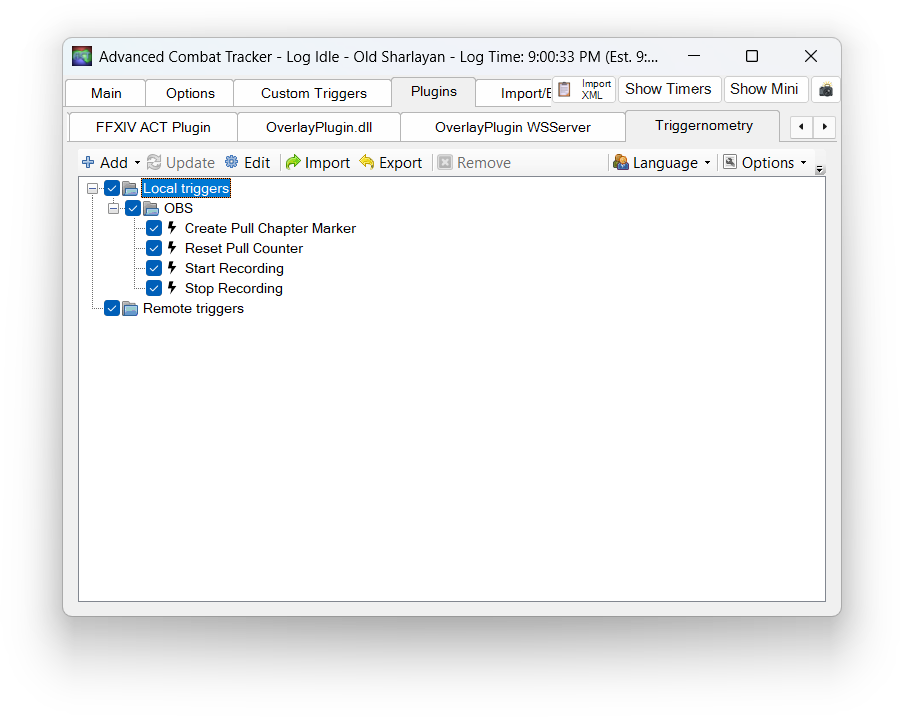

# Triggernometry triggers for FF14 OBS Recordings

### Adds triggers for OBS through WebSocket server

- Start Recording on Duty Pop
- Stop Recording on Duty End
- Create Pull Chapter Markers on Boss Engagement **(must use Hybrid MP4 format in OBS)**
- (Optional) Reset Pull Chapter Marker Counter
    - Type "reset counter" in any chat to reset pull counter

**How To Use**

1. Import in Triggernometry under Local Triggers
2. Enable WebSocket server in OBS
3. In each trigger (except reset trigger), Edit Trigger, then Edit Trigger Actions and update Endpoint URL and Password to what is saved in OBS WebSocket Server Settings